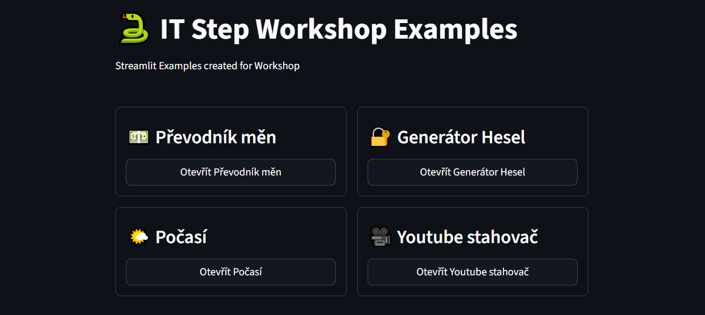

# Streamlit Examples

Simple web apps with Streamlit framework. Each example is a Python file in `apps` folder. Students should implement `main()` function.

Use this cheatsheet for elements:
https://cheat-sheet.streamlit.app/



## ⚙️ Instalation instructions
Clone repository:
```
git clone https://github.com/itstep-praha/streamlit-examples
```

Change dir:
```
cd streamlit-examples
```

Create venv:
```
python -m venv .venv
```

Activate venv on Windows:
```
.venv\Scripts\activate
```
Activate venv on macOS or Linux:
```
source .venv/bin/activate
```

Install requrements:
```
pip install -r requirements.txt
```

Run server:
```
streamlit run app.py
```

To run solved mode set `USE_SOLVED` env variable:

Windows PoweShell
```
$env:USE_SOLVED=1; streamlit run app.py
```

MacOS, Linux
```
USE_SOLVED=1 streamlit run app.py
```
