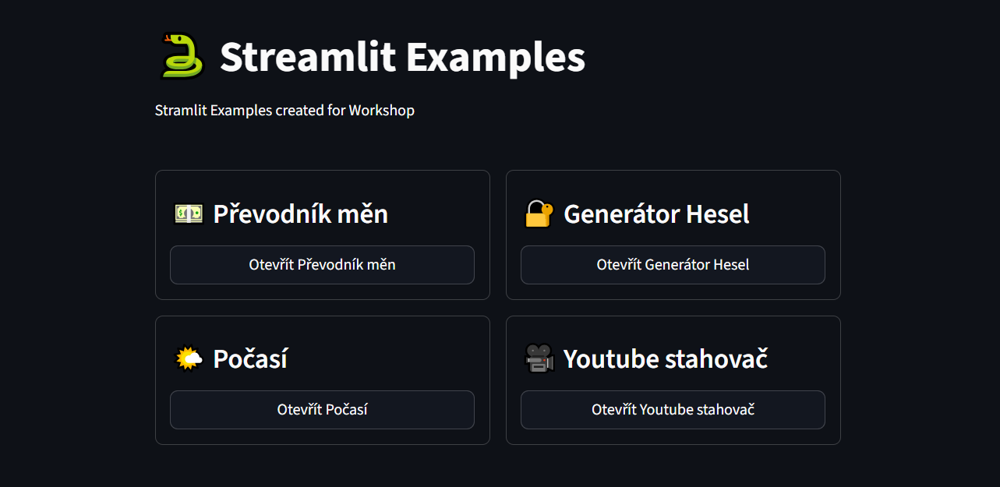

# Streamlit Examples
- Simple web apps with Streamlit framework



## ⚙️ Instalation instructions
Clone repository:
```
git clone https://github.com/itstep-praha/streamlit-examples
```

Change dir:
```
cd streamlit-examples
```

Create venv:
```
python -m venv .venv
```

Activate venv on Windows:
```
.venv\Scripts\activate
```
Activate venv on macOS or Linux:
```
source .venv/bin/activate
```

Install requrements:
```
pip install -r requirements.txt
```

Run server:
```
streamlit run app.py
```
